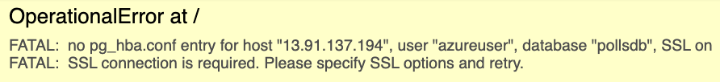
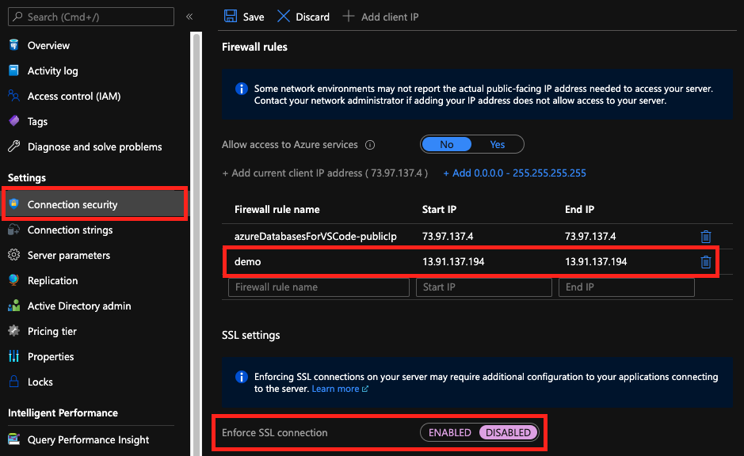

# Django and PostgreSQL sample for Azure App Service

This sample is a simple Django app that connects to a PostgreSQL database. The sample is loosely used with the following tutorials:

- [Deploy a Django web app with PostgreSQL in Azure App Service (Azure CLI)](https://docs.microsoft.com/azure/app-service/containers/tutorial-python-postgresql-app).
- [Deploy a Django web app with PostgreSQL using the Azure portal](https://docs.microsoft.com/en-us/azure/developer/python/tutorial-python-postgresql-app-portal).

When deployed to Azure App Service, the database connection information is specified via environment variables `POSTGRES_DBHOST`, `POSTGRES_DBPASS`, `POSTGRES_DBUSER`, and `POSTGRES_DBNAME`. This app always uses the default PostgreSQL port. 

## Quick Setup Instructions

1. In the VS Code App Service extension: create a new **Python 3.8** webapp.

2. Add a new PostgreSQL database named `pollsdb` as a connection to the webapp.
Leave the prefix as the default (`POSTGRES`).

3. Deploy this repo to the webapp.

4. Browse to the webapp. You should see an error like this:

    

5. Copy the IP and open the PostgreSQL account in the Azure Portal.

6. Click "Connection Security", enter the IP as a new firewall rule, and disable "Enforce SSL connection". Click "Save".

    

7. SSH into the webapp using the App Service extension. 
If it prompts you for a password, exit and try SSHing again.
It should login automatically.

8. Run the following script to migrate the database to the webapp:

    ```bash
    ./pgconfig
    ```

    When prompted, leave username and email address as the defaults. Password is `Pollsdb1`.

9. Reload the webapp in the browser. This page should be displayed:

    

10. ???
